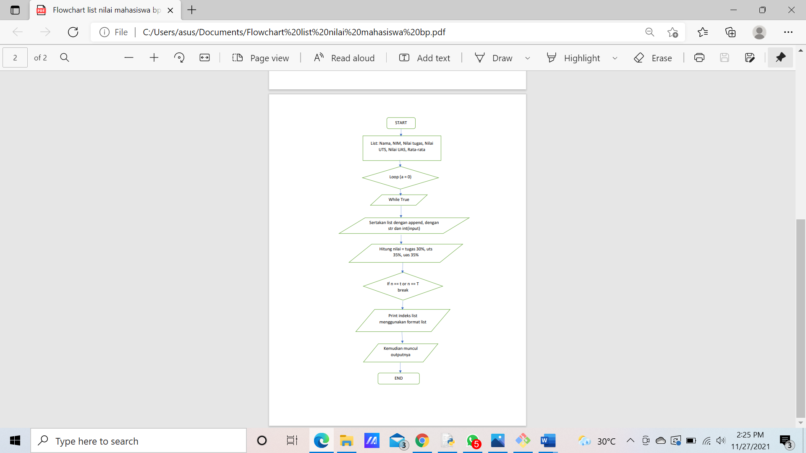
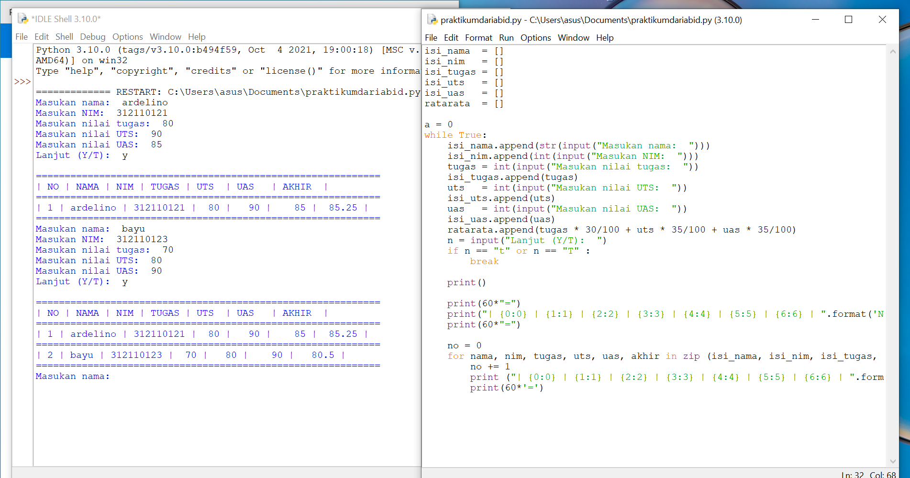
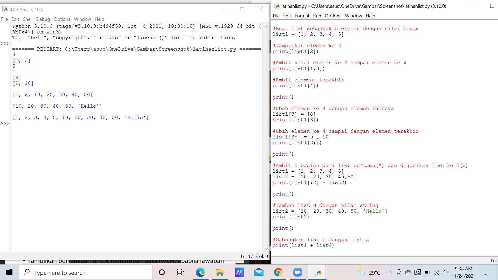

# Praktikum4

Flowchart List Data Nilai Mahasiswa
1.	Mulai
2.	Buat list mulai dari nama, nim, nilai tugas, nilai uts, nilai uas, dan nilai akhir/rata-rata
3.	Buat looping untuk perulangan (a = 0)
4.	Gunakan perulangan while True
5.	Buat list append nya dengan nilai-nilai yang ada pada Langkah ke-2
6.	Hitung nilai akhir dengan ketentuan tugas: 30%, UTS: 35%, UAS: 35%
7.	Buat perulangan if, jika T maka break dan jika Y maka tambah nilai
8.	Cetak indeks list sesuai urutan menggunakan format
9.	Kemudian akan muncul tampilan nilainya.

Input dan Outputnya

Latihan list

